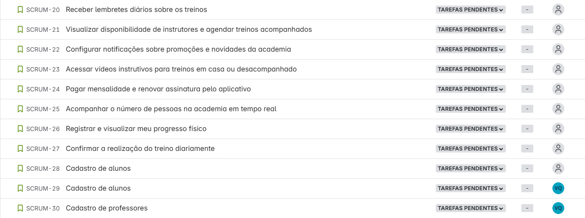
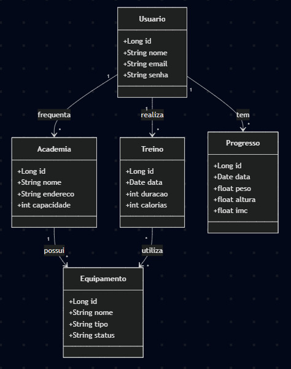
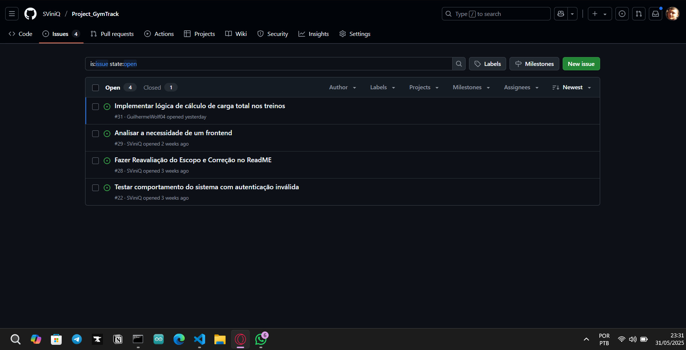

<h1 align="center">GymTrack</h1>

<div align="center">
  <strong>🏋🏽 ⚙️ 🏃🏽</strong>
</div>
<div align="center">
  GymTrack é uma plataforma inteligente de gestão para academias, oferecendo controle automatizado de fluxo de alunos, monitoramento de progresso físico e otimização da experiência dos usuários em tempo real!
</div>

## ✅ Histórias de Usuário
As histórias foram elaboradas no Jira e podem ser acessadas neste link:
 [Jira Board](https://coderfullstackvinicius.atlassian.net/jira/software/projects/SCRUM/boards/1/backlog?atlOrigin=eyJpIjoiYjI0Yzc5YWNmNTJiNGIzYjhlYjg2YzJjMGEyZDdlNjYiLCJwIjoiaiJ9)

Abaixo, Print de todas a histórias:


## 🧪 Protótipo Lo-Fi
Protótipo de baixa fidelidade criado no Figma: 
 [Figma Design](https://www.figma.com/design/P3UNY8tWPJj7FW43XrU9ZE/Untitled?node-id=0-1&t=b3ow5hTyewWG7oIH-1)

## 🧠 Diagrama de Classes


## 📽️ Screencast do Sistema em Execução e Atualizado
🔗 [YouTube – Demonstração Final do Sistema Atualizado](https://youtu.be/498tf5N0Fi4)

## 🐞 Issue/Bug Track
Print da aba de issues do GitHub:  


🔗 [Aba de Issues no GitHub](https://github.com/SViniQ/Project_GymTrack/issues)

## 🔧 Tecnologias Utilizadas

- Java
- Figma (Protótipo)
- GitHub (Controle de versão e issues)
- Jira (Gestão de histórias)
- Framework SpringBoot

## ⚙️ Configuração do Ambiente

Para executar o GymTrack localmente, siga os passos abaixo para configurar o ambiente de desenvolvimento corretamente.

### ✅ Pré-requisitos

Certifique-se de ter as seguintes ferramentas instaladas:

- [Java 17 ou superior](https://www.oracle.com/java/technologies/downloads/)
- [Git](https://git-scm.com/)
- [Docker](https://www.docker.com/)
- [Docker Compose](https://docs.docker.com/compose/)

### 📥 Clonando o Repositório

Clone o repositório utilizando o Git:

```bash
git clone https://github.com/SViniQ/Project_GymTrack.git
cd Project_GymTrack
```

### 🐳 Executando com Docker Compose

O projeto já está preparado para rodar com Docker Compose, o que facilita a configuração do banco de dados e da aplicação.

1. Certifique-se de que o Docker está em execução.

2. Execute o seguinte comando para construir e iniciar os serviços:

```bash
docker-compose up --build
```

3. Aguarde até que todos os containers estejam inicializados.

### 🌐 Acessando a Aplicação

A aplicação estará disponível em: http://localhost:8080

Verifique também as configurações do application.properties ou docker-compose.yml para confirmar a porta configurada.

## 👥 Equipe

- Vinícius Queiroz - [Link do LinkedIn](https://www.linkedin.com/in/viníciussilvaqueiroz/)
- Guilherme Nogueira - [Link do LinkedIn](https://www.linkedin.com/in/guilherme-wolf/)
- Arthur Campos - [Link do LinkedIn](https://www.linkedin.com/in/arthur-campos-a120472b7/)
- Dereck Portela - [Link do LinkedIn](https://www.linkedin.com/in/dereck-portela-36682675/)
- Paulo Mendes - [Link do LinkedIn](https://www.linkedin.com/in/paulo-mendes/)
- Pierre Costa - [Link do LinkedIn](https://www.linkedin.com/in/pierre-costa-b1b51314a/)
- Ylson Santos - [Link do LinkedIn](https://www.linkedin.com/in/ylson-santos/)