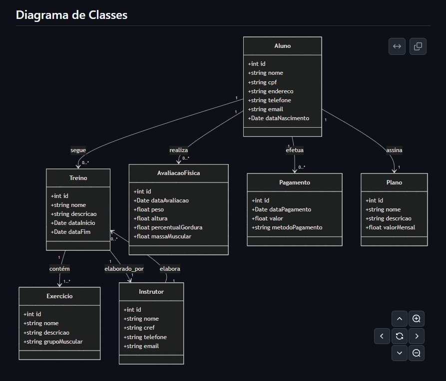
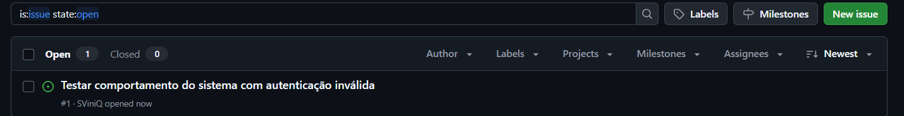

<h1 align="center">GymTrack</h1>

  <strong>🏋🏽 ⚙️ 🏃🏽</strong>

  GymTrack é uma plataforma inteligente de gestão para academias, oferecendo controle automatizado de fluxo de alunos, monitoramento de progresso físico e otimização da experiência dos usuários em tempo real!

## ✅ Histórias de Usuário
As histórias foram elaboradas no Jira e podem ser acessadas neste link:
 [Jira Board](https://coderfullstackvinicius.atlassian.net/jira/software/projects/SCRUM/boards/1/backlog?atlOrigin=eyJpIjoiYjI0Yzc5YWNmNTJiNGIzYjhlYjg2YzJjMGEyZDdlNjYiLCJwIjoiaiJ9)

Abaixo, segue um Print de todas a histórias:

## 🧪 Protótipo Lo-F
Protótipo de baixa fidelidade criado no Figma: 
 [Figma Design](https://www.figma.com/design/P3UNY8tWPJj7FW43XrU9ZE/Untitled?node-id=0-1&t=b3ow5hTyewWG7oIH-1)

## 🧠 Diagrama de Classe

## 📽️ Screencast do Sistema em Execução e Atualizad
🔗 [YouTube – Demonstração do Sistema Atualizado e Testes Automatizados](https://www.youtube.com/watch?v=pdWdF295ZJI)

## 🐞 Issue/Bug Tracker
Print da aba de issues do GitHub:  

🔗 [Aba de Issues no GitHub](https://github.com/SViniQ/Project_GymTrack/issues)

## 🔧 Tecnologias Utilizada

- Java
- Figma (Protótipo)
- GitHub (Controle de versão e issues)
- Jira (Gestão de histórias)
- Framework SpringBoot

## 👥 Equip

- Vinícius Queiroz - [Link do LinkedIn](https://www.linkedin.com/in/viníciussilvaqueiroz/)
- Guilherme Nogueira - [Link do LinkedIn](https://www.linkedin.com/in/guilherme-wolf/)
- Arthur Campos - [Link do LinkedIn](https://www.linkedin.com/in/arthur-campos-a120472b7/)
- Dereck Portela - [Link do LinkedIn](https://www.linkedin.com/in/dereck-portela-36682675/)
- Paulo Mendes - [Link do LinkedIn](https://www.linkedin.com/in/paulo-mendes/)
- Pierre Costa - [Link do LinkedIn](https://www.linkedin.com/in/pierre-costa-b1b51314a/)
- Ylson Santos - [Link do LinkedIn](https://www.linkedin.com/in/ylson-santos/)
